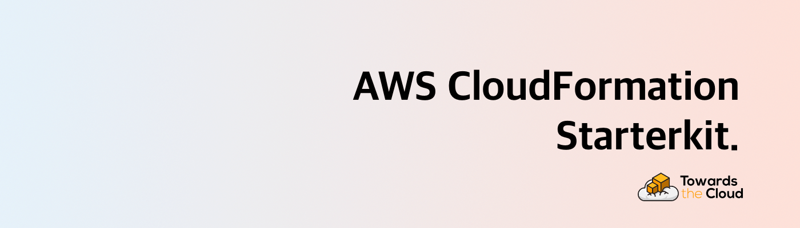
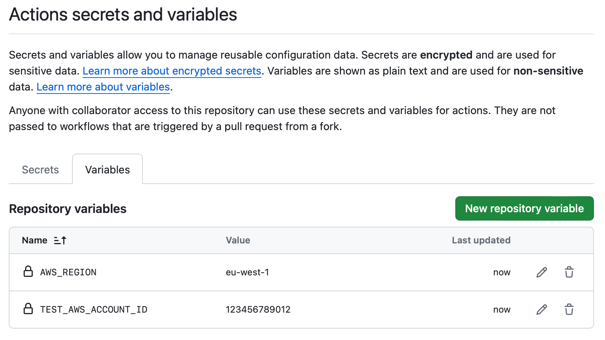

# [](https://towardsthecloud.com)

# AWS CloudFormation Starterkit

> The ultimate starter kit to create and deploy AWS CloudFormation stacks using the Rain tool, enabling rapid infrastructure deployment on your AWS account!

## Intro

Welcome to the AWS CloudFormation Starterkit, designed to streamline your infrastructure setup using CloudFormation templates and the Rain tool. This repository provides a structured approach to managing your AWS resources as code, ensuring efficient and reliable deployments.

> [!TIP]
> [Unlock the full potention of your infrastructure - Partner with Us!](#unlock-the-full-potention-of-your-infrastructure---partner-with-us)

## Features

- ⚡ **Quick Setup**: Get started with your infrastructure CI/CD in minutes by configuring a couple of repository variables.
- 🌐 **Environment Flexibility**: Supports multiple environments (e.g., dev, staging, prod) via GitHub Actions workflows.
- 🤖 **Automated Validation**: Use Checkov and cfn-lint for static analysis of your CloudFormation templates, ensuring compliance and security best practices.
- 🏗️ **Modular Structure**: Organize your templates into logical components for better manageability and scalability.
- 🔒 **Security Best Practices**: Incorporate OIDC for deploying cloudformation stacks in a secure manner in your AWS account via a GitHub Actions workflow.
- 📜 **Comprehensive Documentation**: Detailed README and inline comments to guide you through setup and deployment processes.
- 🚀 **CI/CD Integration**: Ready-to-use GitHub Actions workflows for automated deployments and validations.

## Setup Guide

This project requires **Python 3** and **pip** for managing dependencies.

**To get started, follow these steps:**

1. Clone this repository:

```bash
git clone https://github.com/dannysteenman/aws-cloudformation-starterkit.git
cd aws-cloudformation-starterkit
```

1. Install checkov, cfn-lint via pip & rain via homebrew:

```bash
brew install rain
pip install -r requirements.txt
```

3. Run the `provision-repo.sh` script to generate the parameter and workflow files for your environment and in the repository with your AWS account information and the necessary variables for the OIDC provider.

```bash
./scripts/provision-repo.sh
```

4. Validate your CloudFormation templates with cfn-lint and checkov using the provided script:

```bash
./scripts/validate.sh
```

5. Deploy the oidc-provider CloudFormation stack using the `deploy-templates.sh` script:

```bash
./scripts/deploy-templates.sh
```

> [!WARNING]
> Make sure that you have the required IAM role or user setup in your aws config file. Use a tool such as [Granted](https://github.com/common-fate/granted) to make accessing your AWS account via the CLI easier and more secure.


Now that you have successfully deployed the OIDC provider, you can use the following steps to configure your GitHub repository with the necessary variables, so that the CI/CD workflow can be used to deploy your CloudFormation stacks.

6. Navigate to your repository's settings page on GitHub.
   1. In the left sidebar, click on "Secrets and variables".
   2. Click on "Actions" and then "New repository variable".
   3. add the following variables:

Note: Make sure to modify the values of the variables to match your specific account and region.



You can now use the provided GitHub Actions workflows to deploy your CloudFormation stacks. Simply commit your changes to the main branch of your repository by adding new stacks to the `./templates` folder and the workflow will automatically deploy your stacks.

## Project Structure

This starter kit is organized to promote best practices in managing CloudFormation templates:

```bash
.
├── .cfnlintrc
├── .checkov.yml
├── .github
│  ├── pull-request-template.md
│  └── workflows
      ├── cfn-lint-scan.yml
│     ├── checkov-scan.yml
│     └── cloudformation-deploy-test.yml
├── LICENSE
├── parameters
│  ├── production
│  │  └── oidc-provider.yml
│  └── test
│     └── oidc-provider.yml
├── README.md
├── requirements.txt
├── scripts
│  ├── provision-repo.sh
│  ├── deploy-templates.sh
│  └── validate-templates.sh
└── templates
   └── oidc-provider.yml
```

### Key Components

- `parameters/`: This directory contains parameter files for different environments, such as `production` and `test`. Each subdirectory corresponds to an environment and contains YAML files that define parameters specific to that environment. It's important to ensure that the filename of each parameter file matches the corresponding template name in the `templates/` directory. This naming convention allows scripts to correctly associate parameters with their respective templates during deployment.
- `.cfnlintrc`: This file is the configuration for cfn-lint, a tool used to validate CloudFormation templates against AWS best practices and syntax rules.
- `.checkov.yml`: This configuration file is used by Checkov, a static analysis tool for infrastructure as code. It defines the rules and policies that Checkov will enforce when scanning your CloudFormation templates.
- `.github/workflows/`: Contains GitHub Actions workflows for CI/CD.
- - `cfn-lint-scan.yml`: Automates the validation of CloudFormation templates using cfn-lint to ensure compliance with AWS best practices and syntax rules.
- - `checkov-scan.yml`: Automates the validation of CloudFormation templates using Checkov to ensure compliance and security.
- - `cloudformation-deploy-test.yml`: Manages the deployment of CloudFormation stacks for testing purposes.
- `scripts/`: Contains shell scripts for managing templates.
- - `deploy-templates.sh`: Automates the deployment of CloudFormation templates using the Rain tool.
- - `provision-repo.sh`: Generates the parameter and workflow files for your environment and in the repository with your AWS account information and the necessary variables for the OIDC provider.
- - `validate-templates.sh`: Validates CloudFormation templates using Checkov to ensure they adhere to best practices.
- `templates/`: Stores CloudFormation templates.
- - `oidc-provider.yml`: Example template for setting up an OpenID Connect provider in AWS.

## CI/CD Integration

This starter kit includes GitHub Actions workflows for automated validation and deployment. Customize the workflows in the `.github/workflows/` directory to suit your CI/CD needs.

Checkov Scan: Automatically runs Checkov on your templates to catch security and compliance issues before deployment.
CloudFormation Deploy Test: Deploys your CloudFormation stacks in a test environment to ensure everything works as expected.

## Unlock the full potention of your infrastructure - Partner with us!

> [!TIP]
> Supercharge Your AWS Infrastructure with [Towards the Cloud](https://towardsthecloud.com). We ship well-architected, resilient, and cost-optimized AWS solutions designed to scale using Infrastructure as Code (IaC), tailoring cloud-native systems for businesses of all sizes.
>
> Our Approach:
>
> - **Tailored AWS Solutions**: Custom-built for your unique business needs
> - **Future-Proof Architecture**: Scalable designs that grow with you
> - **Empowerment Through Ownership**: Your vision, your infrastructure, our expertise
>
> Why Choose Us:
> - 10+ Years of AWS Experience
> - 7x AWS Certified, including DevOps Engineer & Solutions Architect Professional
> - Proven Track Record: 40% Average Reduction in Operational Costs
>
> Ready to elevate your Infrastructure?
>
> <a href="https://towardsthecloud.com/contact"></a>
> <details><summary>☁️ <strong>Discover more about my one-person business: Towards the Cloud</strong></summary>
>
> <br/>
>
> Hi, I'm Danny – AWS expert and founder of [Towards the Cloud](https://towardsthecloud.com). With over a decade of hands-on experience, I specialized myself in deploying well-architected, highly scalable and cost-effective AWS Solutions using Infrastructure as Code (IaC).
>
> #### When you work with me, you're getting a package deal of expertise and personalized service:
>
> - **AWS CDK Proficiency**: I bring deep AWS CDK knowledge to the table, ensuring your infrastructure is not just maintainable and scalable, but also fully automated.
> - **AWS Certified**: [Equipped with 7 AWS Certifications](https://www.credly.com/users/dannysteenman/badges), including DevOps Engineer & Solutions Architect Professional, to ensure best practices across diverse cloud scenarios.
> - **Direct Access**: You work with me, not a team of managers. Expect quick decisions and high-quality work.
> - **Tailored Solutions**: Understanding that no two businesses are alike, I Custom-fit cloud infrastructure for your unique needs.
> - **Cost-Effective**: I'll optimize your AWS spending without cutting corners on performance or security.
> - **Seamless CI/CD**: I'll set up smooth CI/CD processes using GitHub Actions, making changes a breeze through Pull Requests.
>
> *My mission is simple: I'll free you from infrastructure headaches so you can focus on what truly matters – your core business.*
>
> Ready to unlock the full potential of AWS Cloud?
>
> <a href="https://towardsthecloud.com/contact"></a>
> </details>

## AWS CDK Starterkit

> **Looking for a more modern approach to managing your AWS infrastructure?** Consider using the [AWS CDK Starterkit](https://github.com/dannysteenman/aws-cdk-starterkit) for a tailored experience that leverages the full power of AWS CDK with TypeScript.

AWS CDK offers several advantages over traditional CloudFormation, such as improved developer experience through the use of familiar programming languages, higher abstraction with reusable constructs, and seamless integration with development workflows. These features make AWS CDK a highly recommended choice for more efficient and flexible infrastructure management.

[Explore the AWS CDK Starterkit](https://github.com/dannysteenman/aws-cdk-starterkit) and start building your infrastructure with greater efficiency and flexibility today!

## Acknowledgements

Special thanks to the creators of [Rain](https://github.com/aws-cloudformation/rain), [Checkov](https://github.com/bridgecrewio/checkov), and [cfn-lint](https://github.com/aws-cloudformation/cfn-lint) for their invaluable tools that make infrastructure management easier and more secure.

## Author

Danny Steenman

[](https://www.linkedin.com/in/dannysteenman)
[](https://twitter.com/dannysteenman)
[](https://github.com/dannysteenman)
