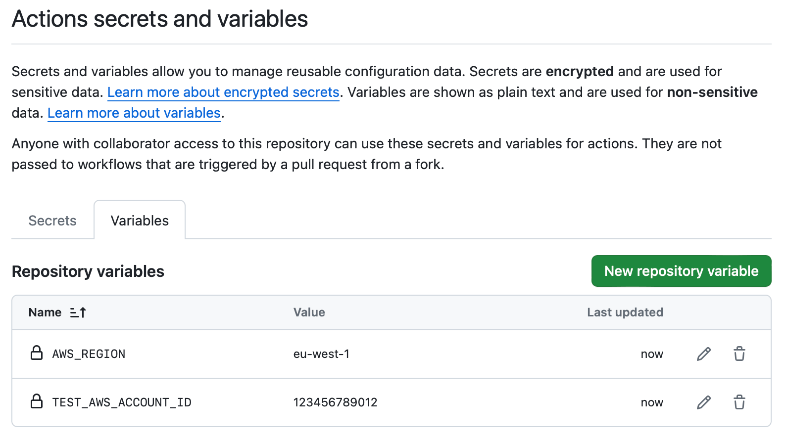

# [](https://towardsthecloud.com)

# AWS CloudFormation Starter Kit

Welcome to the AWS CloudFormation Starter Kit, designed to streamline your infrastructure setup using CloudFormation templates and the Rain tool. This repository provides a structured approach to managing your AWS resources as code, ensuring efficient and reliable deployments.

## 🚀 Features

- ⚡ **One-Command Setup**: Single bootstrap script automatically sets up your infrastructure pipeline
  - Generates environment-specific parameter files
  - Provisions OIDC provider for secure keyless authentication
  - Auto-generates GitHub Actions workflows for CI/CD
- 🔒 **Secure Deployments**: Deploy stacks via OIDC-authenticated GitHub Actions—no long-lived IAM credentials needed
- 🤖 **Pre-Commit Validation**: cfn-lint and Checkov catch issues before deployment
- 🌐 **Multi-Environment Support**: Separate parameter files for dev, staging, and production with isolated workflows

<!-- TIP-LIST:START -->
> [!TIP]
> **Stop AWS bill surprises before they ship.**
>
> Most infrastructure changes look harmless until next month's AWS bill lands. [CloudBurn](https://cloudburn.io) analyzes the cost impact of your AWS CDK changes right in the GitHub pull request, so expensive mistakes get caught during code review, while a fix is still a one-line change.
>
> <a href="https://github.com/marketplace/cloudburn-io"></a>
>
> <details>
> <summary>💰 <strong>Set it up once, then never be surprised by AWS costs again</strong></summary>
> <br/>
>
> 1. **Install the free [CDK Diff PR Commenter GitHub Action](https://github.com/marketplace/actions/aws-cdk-diff-pr-commenter)** in the repository where you build your AWS CDK infrastructure
> 2. **Then install the [CloudBurn GitHub App](https://github.com/marketplace/cloudburn-io)** on the same repository
>
> From then on, every PR with infrastructure changes gets a comment with your CDK diff analysis, and CloudBurn adds a cost report next to it:
> - **Monthly cost impact**: whether this change raises or lowers your AWS bill, and by how much
> - **Per-resource breakdown**: which resources drive the change, old versus new monthly cost
> - **Region-aware pricing**: rates match the region your infrastructure actually deploys to
>
> Cost review happens inside code review, so you optimize as you code, while the context is still fresh.
>
> CloudBurn is free during beta. After launch, a free Community plan (1 repository, unlimited users) stays available.
>
> </details>
<!-- TIP-LIST:END -->

## Quick Start

This project requires **Python 3** and **pip** for managing dependencies.

**To get started, follow these steps:**

1. Click the green ["Use this template"](https://github.com/new?template_name=aws-cloudformation-starter-kit&template_owner=towardsthecloud) button to create a new repository based on this starter kit.

2. Install checkov, cfn-lint via pip & rain via homebrew:

```bash
brew install rain
pip install -r requirements.txt
```

3. Run the `provision-repo.sh` script to generate the parameter and workflow files for your environment:

```bash
./scripts/provision-repo.sh
```

4. Validate your CloudFormation templates:

```bash
./scripts/validate.sh
```

5. Deploy the oidc-provider CloudFormation stack:

```bash
./scripts/deploy-templates.sh
```

> [!WARNING]
> Make sure that you have the required IAM role or user setup in your aws config file. Use a tool such as [Granted](https://github.com/common-fate/granted) to make accessing your AWS account via the CLI easier and more secure.

6. Navigate to your repository's settings on GitHub and configure the Actions variables as shown below:



You can now deploy your CloudFormation stacks by committing changes to the main branch.

## Full Documentation

For complete details on how this starter kit works, advanced configuration options, and best practices, visit the official documentation:

**[View Full Documentation →](https://towardsthecloud.com/docs/aws-cloudformation-starter-kit)**

## AWS CDK Starter Kit

> **Looking for a more modern approach to managing your AWS infrastructure?** Consider using the [AWS CDK Starter Kit](https://github.com/towardsthecloud/aws-cdk-starter-kit) for a tailored experience that leverages the full power of AWS CDK with TypeScript.

## Acknowledgements

Special thanks to the creators of [Rain](https://github.com/aws-cloudformation/rain), [Checkov](https://github.com/bridgecrewio/checkov), and [cfn-lint](https://github.com/aws-cloudformation/cfn-lint) for their invaluable tools that make infrastructure management easier and more secure.

## Author

[Danny Steenman](https://towardsthecloud.com/about)

[](https://www.linkedin.com/company/towardsthecloud)
[](https://twitter.com/dannysteenman)
[](https://github.com/towardsthecloud)
